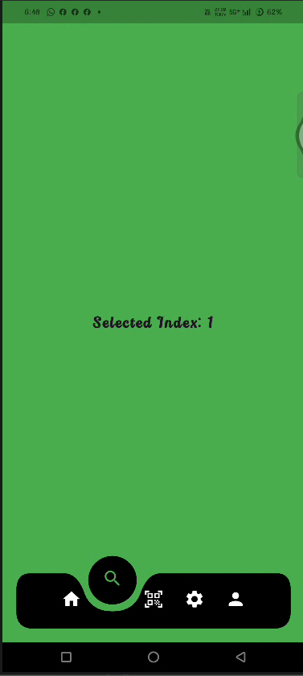
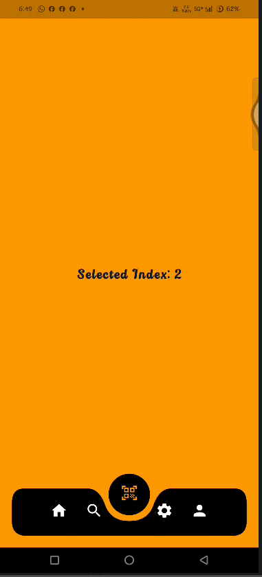
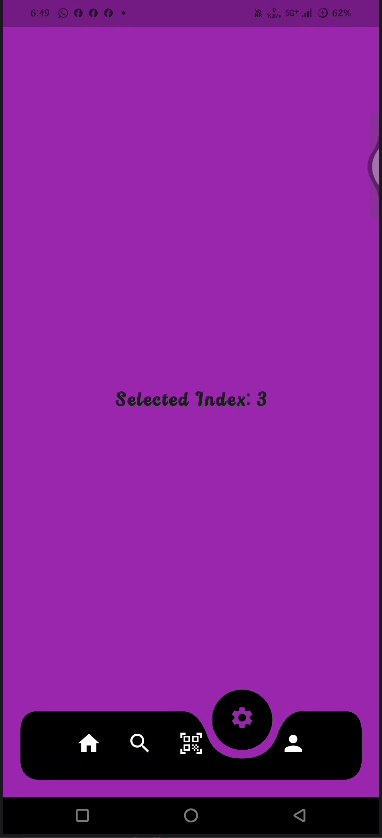
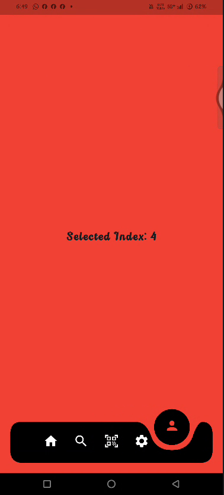

# Flutter Curved Animated Bottom Navigation Bar 🎉

> **First time making a curve animated navigation bar ... pure joy **

A Flutter project created while learning and experimenting with `CustomPainter`, `Path`, `QuadraticBezier`, `AnimationController`, and GetX.

The main goal of this project was to create a completely custom curved bottom navigation bar instead of using Flutter's default `BottomNavigationBar`.

The result is a navigation bar with a smooth animated circle that moves underneath the selected navigation item. The application also changes its background color according to the currently selected navigation item.

This project may look simple, but building the curved shape and getting the animation to move correctly was a really enjoyable learning experience.

---

##  Screenshots

### Understanding the Curve

The curved navigation bar is created using Flutter's `CustomPainter` and `Path`. The following diagram helped visualize the different points and `quadraticBezierTo()` operations used to construct the navigation shape.

<p align="center">
  
</p>

---

### Animated Navigation States

The navigation bar contains five navigation items:

**Home → Search → Scan → Settings → Profile**

<p align="center">
  
  
  
  
  
</p>

Each screenshot represents a different selected navigation index.

| Index | Navigation Item | Color |
|------:|-----------------|-------|
| 0 | 🏠 Home | Blue |
| 1 | 🔍 Search | Green |
| 2 | 📷 Scan | Orange |
| 3 | ⚙️ Settings | Purple |
| 4 | 👤 Profile | Red |

---

## ✨ About The Project

This project is my first attempt at creating a custom animated curved navigation bar in Flutter.

Instead of relying on a ready-made navigation package, I wanted to understand how the shape and animation actually work internally.

The navigation bar is drawn manually using Flutter's `CustomPainter`. A custom `Path` is constructed using multiple `quadraticBezierTo()` operations. These curves create the indentation where the selected navigation icon sits.

The selected icon has a circular area around it, and this circle moves smoothly whenever another navigation item is selected.

The application also displays the currently selected index in the center of the screen.

For example:

```text
Selected Index: 0
```

When Search is selected:

```text
Selected Index: 1
```

and so on until:

```text
Selected Index: 4
```

The project was mainly created as a learning experiment and as a way to understand Flutter animations and custom painting more deeply.

---

## 🚀 Features

### 🎨 Custom Curved Navigation Bar

The navigation bar is completely custom-built using:

- `CustomPainter`
- `Canvas`
- `Path`
- `quadraticBezierTo()`
- `drawPath()`
- `drawCircle()`

No ready-made curved navigation package is required for the actual navigation design.

### 🔵 Animated Selected Circle

When the user selects an item, the circular drop moves from the previous position to the new position.

The movement is controlled using:

```dart
AnimationController
```

and:

```dart
CurvedAnimation(
  curve: Curves.easeOutBack,
)
```

The `easeOutBack` curve gives the animation a small natural overshoot effect.

### 🧭 Five Navigation Items

The navigation bar contains five items:

```dart
Icons.home
Icons.search
Icons.qr_code_scanner
Icons.settings
Icons.person
```

Each item has its own color.

### 🌈 Dynamic Background

The application background changes according to the selected navigation item.

```dart
final List<Color> colors = [
  Colors.blue,
  Colors.green,
  Colors.orange,
  Colors.purple,
  Colors.red,
];
```

Therefore:

```text
Home     → Blue
Search   → Green
Scan     → Orange
Settings → Purple
Profile  → Red
```

The background transition is animated using `AnimatedContainer`.

### 🎯 Selected Index

The currently selected navigation index is displayed on the screen.

```dart
Selected Index: 0
```

This was also useful while developing the navigation logic because it made it easy to verify that the correct item was being selected.

### ⚡ Smooth Icon Animation

The icons use:

```dart
AnimatedContainer
```

and:

```dart
AnimatedSwitcher
```

to smoothly change their position and appearance when the selected item changes.

### 📱 Responsive Layout

The navigation bar calculates its position based on the available screen width.

The selected circle position is calculated dynamically rather than using fixed screen coordinates.

This allows the navigation bar to adapt to different screen widths.

---

## 🛠️ Tech Stack

- **Flutter** — UI framework
- **Dart** — Programming language
- **GetX** — State management and dependency injection
- **CustomPainter** — Custom navigation shape
- **Canvas** — Drawing the navigation bar
- **Path** — Creating the curved geometry
- **AnimationController** — Controlling the movement animation
- **AnimatedBuilder** — Rebuilding the painter during animation
- **AnimatedContainer** — Smooth UI transitions
- **AnimatedSwitcher** — Icon transitions

---

## 🧠 How The Animation Works

The most interesting part of this project is calculating the position of the selected circle.

Each navigation item has an index:

```text
0  1  2  3  4
```

The controller calculates the X position for each index using the available screen width.

When an item is tapped, the new position is calculated:

```dart
final double newPosition =
    getEndPosition(context, index);
```

Then a `Tween` is created:

```dart
animation = Tween<double>(
  begin: position,
  end: newPosition,
).animate(
  CurvedAnimation(
    parent: controller,
    curve: Curves.easeOutBack,
  ),
);
```

Finally:

```dart
controller.forward(from: 0);
```

starts the animation.

The `CustomPainter` receives the animated X position:

```dart
CurvedNavPainter(
  controller.animation.value,
)
```

and redraws the curved navigation bar as the animation progresses.

---

## 🎨 Creating The Curve

The navigation shape is created using Flutter's `Path` API.

The most important methods are:

```dart
path.moveTo()
```

```dart
path.lineTo()
```

```dart
path.quadraticBezierTo()
```

The selected area is created using multiple quadratic Bézier curves.

For example:

```dart
path.quadraticBezierTo(
  40.0 + x,
  start + 55.0,
  70.0 + x,
  start + 55.0,
);
```

The `x` value changes during the animation.

That means the curved section itself moves as the selected navigation item changes.

This was probably the most interesting part of the project to understand.

---

## 📂 Project Structure

```text
lib/
│
├── main.dart
│
└── features/
    │
    └── main_navigation/
        │
        ├── bindings/
        │   └── navigation_binding.dart
        │
        ├── controllers/
        │   └── navigation_controller.dart
        │
        ├── screens/
        │   └── main_navigation_screen.dart
        │
        └── widgets/
            ├── curved_bottom_nav.dart
            └── curved_nav_painter.dart
```

### `navigation_controller.dart`

Responsible for:

- Selected navigation index
- Animation controller
- Navigation item positions
- Icon list
- Icon colors
- Selection logic
- Animation triggering

### `curved_bottom_nav.dart`

Responsible for:

- Displaying navigation items
- Handling taps
- Displaying selected/unselected icons
- Running icon animations
- Connecting the UI to the controller

### `curved_nav_painter.dart`

Responsible for:

- Drawing the curved navigation bar
- Drawing the selected circle
- Creating Bézier curves
- Redrawing the shape during animation

### `main_navigation_screen.dart`

Responsible for:

- Main screen layout
- Displaying the selected index
- Hosting the curved navigation bar

---

## ▶️ Getting Started

### 1. Clone the repository

```bash
git clone https://github.com/YOUR-USERNAME/navigation_bottom.git
```

### 2. Open the project

```bash
cd navigation_bottom
```

### 3. Install dependencies

```bash
flutter pub get
```

### 4. Run the application

```bash
flutter run
```

You can run it on an Android device, emulator, Chrome, Edge, or another supported Flutter platform.

---

## 📦 Dependencies

The main external dependency used by this project is:

```yaml
get: ^latest
```

Flutter's built-in animation and painting APIs are used for the actual curved navigation design.

No dedicated curved-navigation package is required.

---

## 💡 What I Learned

This project taught me much more than simply creating a bottom navigation bar.

While building it, I learned how Flutter's rendering system can be used to create custom UI components from scratch.

Some of the important concepts I explored were:

- `CustomPainter`
- `Canvas`
- `Path`
- Bézier curves
- Coordinate calculations
- `AnimationController`
- `Tween`
- `CurvedAnimation`
- `AnimatedBuilder`
- `AnimatedContainer`
- `AnimatedSwitcher`
- GetX controllers
- GetX dependency injection
- Responsive positioning
- Separating UI and controller logic

The biggest learning moment was understanding that the curved navigation bar is not a special Flutter widget. It is simply a shape that can be mathematically constructed using a `Path` and then animated by changing its coordinates.

---

## ❤️ Why I Made This

This project started as an experiment.

I wanted to see whether I could take a design idea for a modern curved navigation bar and actually build it myself in Flutter.

There were several small problems along the way — especially around animation controllers, widget rebuilding, state management, and calculating the correct position of the selected circle.

But getting the animation to finally move correctly between all five icons was **pure joy**.

This is my **first curve animated navigation bar**, and although it is still a learning project, it represents an important step in understanding custom Flutter UI and animations.

> **First time making a curve animated navigation bar ... pure joy 💙**

---

## 🔮 Future Improvements

Some improvements I would like to add in the future:

- Real Home screen
- Real Search screen
- QR/Scan screen
- Settings screen
- Profile screen
- `IndexedStack` page switching
- Light and dark theme support
- Better responsive sizing
- Safe-area handling
- Custom icon animations
- Better accessibility
- More customizable colors
- Configurable number of navigation items
- More advanced curve animations

---

## 🤝 Contributing

This is primarily a learning project, but suggestions and improvements are welcome.

If you find a bug or have an idea for improving the animation, feel free to open an issue.

You can also fork the repository and experiment with your own version of the curved navigation bar.

---

## ⭐ Support

If you found this project useful or interesting, consider giving the repository a ⭐ on GitHub.

It helps motivate me to continue experimenting with Flutter animations, custom UI, and more advanced app development.

---

## 📄 License

This project is open-source and available under the MIT License.

---

## 👨‍💻 Final Note

This project may be small, but it was a valuable learning experience.

From manually drawing the curve with `Path` to calculating the selected position and animating the circle across five navigation items, every part helped me understand Flutter a little better.

**First curved animated navigation bar: completed. 🎉**

**And yes... it was pure joy. 💙**
